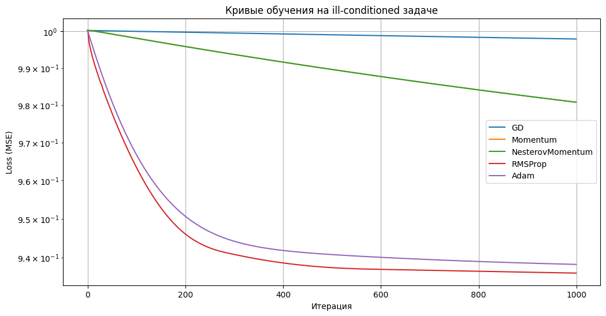
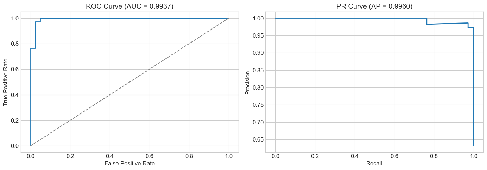

# optimizer-playground


Экспериментальная песочница для исследования оптимизаторов на линейных моделях (Linear/Logistic Regression) с реализациями GD/Momentum/RMSProp/Adam/AdamW, регуляризацией и воспроизводимыми экспериментами.

> Реализация на NumPy без autograd - градиенты и апдейты реализованы вручную.

## Highlights

- **Оптимизаторы**: GD, Momentum, NesterovMomentum, RMSProp, Adam, AdamW (decoupled weight decay)
- **Closed-form решения**: OLS и Ridge для линейной регрессии
- **Лоссы**: MSE, RMSE, MAE, Huber, LogCosh + LogLoss/CrossEntropy для классификации
- **Регуляризация**: L1 (Lasso), L2 (Ridge), ElasticNet - L1/EN через проксимальные операторы (в коде: `Elastic_Net`)
- **Mini-batch обучение** со сглаживанием истории loss
- **CLI-скрипт** с логированием экспериментов в `logs/runs.csv` и sanity-check со sklearn
- **Pytest**: проверка градиентов (finite-diff) и корректности оптимизаторов/моделей

## Содержание

- [Demo](#demo)
- [Установка](#установка)
- [Quickstart](#quickstart)
- [CLI: Запуск экспериментов](#cli-запуск-экспериментов)
- [Структура проекта](#структура-проекта)
- [Детали реализации](#детали-реализации)
- [Ноутбуки](#ноутбуки)
- [Тесты](#тесты)
- [Roadmap](#roadmap)
- [References](#references)
- [License](#license)

## Demo


*Сравнение сходимости оптимизаторов на ill-conditioned задаче - получено в [02_optimizers_comparison.ipynb](notebooks/02_optimizers_comparison.ipynb)*


*ROC и PR кривые для логистической регрессии - получено в [03_logistic_regression_classification.ipynb](notebooks/03_logistic_regression_classification.ipynb)*

## Установка

**Требования:** Python 3.12+

```bash
# Создание виртуального окружения
python -m venv .venv
source .venv/bin/activate  # macOS/Linux
python -m pip install -U pip

# Клонирование репозитория
git clone https://github.com/1dober1/optimizer-playground.git
cd optimizer-playground

# Базовая установка (runtime)
pip install -e .

# Для ноутбуков (jupyter, matplotlib, pandas)
pip install -r requirements.txt

# Для разработки (pytest, ruff, coverage)
pip install -r requirements-dev.txt
```

## Quickstart

### Подготовка данных

```python
import numpy as np
from sklearn.datasets import make_regression, make_classification
from sklearn.model_selection import train_test_split
from sklearn.preprocessing import StandardScaler

# Для регрессии
X, y = make_regression(n_samples=200, n_features=50, noise=10.0, random_state=42)
# Для классификации:
# X, y = make_classification(n_samples=500, n_features=20, n_classes=2, random_state=42)

X = StandardScaler().fit_transform(X)
X_train, X_test, y_train, y_test = train_test_split(X, y, test_size=0.2, random_state=42)
```

### Linear Regression: Closed-form

```python
from src.models import LinearRegression

model = LinearRegression(solver="closed")
model.fit(X_train, y_train)
y_pred = model.predict(X_test)
```

### Linear Regression: Iterative (Adam + L2)

```python
from src.models import LinearRegression
from src.optimizers.adam import Adam
from src.losses import MSE
from src.regularizers import L2

model = LinearRegression(
    solver="iterative",
    opt=Adam(lr=0.01),
    loss=MSE(),
    reg=L2(alpha=0.001),
    steps=2000,
    random_state=42,
)
model.fit(X_train, y_train)
y_pred = model.predict(X_test)
```

### Logistic Regression: Binary

```python
from src.models import LogisticRegression
from src.optimizers.adam import Adam

model = LogisticRegression(
    opt=Adam(lr=0.01),
    steps=1000,
    batch_size=32,
    random_state=42,
)
model.fit(X_train, y_train)

proba = model.predict_proba(X_test)
y_pred = model.predict(X_test)
```

### Logistic Regression: Multiclass

```python
from src.models import LogisticRegression
from src.optimizers.adamw import AdamW

# y_train содержит метки классов: 0, 1, 2, ...
model = LogisticRegression(
    opt=AdamW(lr=0.01),
    steps=1500,
    random_state=42,
)
model.fit(X_train, y_train)
y_pred = model.predict(X_test)
```

## CLI: Запуск экспериментов

Скрипт `scripts/train.py` позволяет запускать эксперименты из командной строки с автоматическим логированием.

```bash
python scripts/train.py --help
```

### Примеры команд

```bash
# Linear Regression + GD
python scripts/train.py --model linear --opt gd --lr 0.01 --steps 1000

# Linear Regression + AdamW + L2 (decoupled weight decay)
python scripts/train.py --model linear --opt adamw --lr 0.01 --reg l2 --alpha 0.001 --steps 2000

# Linear Regression closed-form Ridge
python scripts/train.py --model linear --solver closed --reg l2 --alpha 0.1

# Logistic Regression binary
python scripts/train.py --model logistic --opt adam --lr 0.01 --steps 1000 --n_classes 2

# Logistic Regression multiclass
python scripts/train.py --model logistic --opt adam --lr 0.01 --steps 1500 --n_classes 5

# Mini-batch обучение
python scripts/train.py --model linear --opt adam --lr 0.01 --batch_size 32 --steps 2000
```

### Ключевые флаги

| Флаг | Описание |
|------|----------|
| `--model` | `linear` или `logistic` |
| `--solver` | `closed` или `iterative` (только для linear) |
| `--opt` | Оптимизатор: `gd`, `momentum`, `nesterov`, `rmsprop`, `adam`, `adamw` |
| `--loss` | Функция потерь для regression: `mse`, `rmse`, `mae`, `huber`, `logcosh` |
| `--reg` | Регуляризация: `none`, `l1`, `l2`, `elastic` |
| `--alpha`, `--l1_ratio` | Параметры регуляризации |
| `--batch_size` | Включает mini-batch режим |
| `--lr`, `--steps`, `--seed` | Learning rate, число шагов, seed |
| `--n_samples`, `--n_features`, `--noise`, `--n_classes` | Параметры генерации датасета |

> **Примечание**: для `--model logistic` параметр `--loss` игнорируется - автоматически выбирается LogLoss (binary) или CrossEntropy (multiclass).

### Логирование

Результаты сохраняются в `logs/runs.csv`:

| Категория | Поля |
|-----------|------|
| Гиперпараметры | `model`, `solver`, `opt`, `lr`, `steps`, `batch_size`, `loss`, `reg`, `alpha`, `l1_ratio`, `fit_intercept` |
| Regression метрики | `mse`, `rmse`, `mae`, `r2_score`, `mape`, `zero_weights`, `sparsity` |
| Classification метрики | `accuracy`, `precision`, `recall`, `f1` |
| Мета | `timestamp`, `train_time_sec`, `final_train_loss` |

Каждый запуск включает **sanity-check** со sklearn и выводит разницу.

## Структура проекта

```text
optimizer-playground/
├── src/
│   ├── models.py          # LinearRegression, LogisticRegression
│   ├── losses.py          # MSE, RMSE, MAE, Huber, LogCosh, LogLoss, CrossEntropyLoss
│   ├── regularizers.py    # L1, L2, Elastic_Net
│   ├── metrics.py         # Метрики качества
│   ├── utils.py           # BatchIterator
│   └── optimizers/
│       ├── gd.py          # Gradient Descent
│       ├── momentum.py    # Momentum, NesterovMomentum
│       ├── rmsprop.py     # RMSProp
│       ├── adam.py        # Adam
│       └── adamw.py       # AdamW (decoupled weight decay)
├── scripts/
│   └── train.py           # CLI-скрипт для экспериментов
├── notebooks/
│   ├── 01_linear_regression_demo.ipynb
│   ├── 02_optimizers_comparison.ipynb
│   └── 03_logistic_regression_classification.ipynb
├── tests/
│   ├── test_loss.py
│   ├── test_model.py
│   ├── test_optimizers.py
│   └── test_regularizers.py
└── logs/
    └── runs.csv           # Логи экспериментов
```

### Поддерживаемые компоненты

| Категория | Компоненты |
|-----------|------------|
| Оптимизаторы | GD, Momentum, NesterovMomentum, RMSProp, Adam, AdamW |
| Лоссы (regression) | MSE, RMSE, MAE, Huber, LogCosh |
| Лоссы (classification) | LogLoss (binary), CrossEntropyLoss (multiclass) |
| Регуляризаторы | L1 (prox), L2 (gradient), Elastic_Net (prox+grad) |
| Режимы обучения | Full-batch, Mini-batch |
| Solver (LinearRegression) | closed (OLS/Ridge), iterative (градиентные методы) |

## Детали реализации

### Численная стабильность

- **Sigmoid**: реализован через условное ветвление для предотвращения overflow (`z >= 0` и `z < 0` обрабатываются отдельно)
- **Softmax**: сдвиг на максимум по строке перед экспонентой для избежания overflow

### Регуляризация

- **L1/Elastic_Net**: используют проксимальный оператор (soft-thresholding) вместо субградиента
- **L2**: добавляется как градиентный штраф или через closed-form (Ridge)
- **AdamW**: реализует decoupled weight decay - регуляризация применяется напрямую к весам, а не через градиент

### AdamW и intercept

- При decoupled weight decay **intercept исключается** из decay - на практике это улучшает сходимость

### Closed-form Ridge

- Формула: \[
\mathbf{w} = \left(\mathbf{X}^\top \mathbf{X} + \alpha\, n\, \mathbf{I}\right)^{-1}\mathbf{X}^\top \mathbf{y}
\]
- Коэффициент `alpha * n` обеспечивает совместимость со sklearn Ridge (у sklearn alpha масштабируется иначе)

### Сглаживание loss

- При mini-batch обучении loss сглаживается экспоненциальным скользящим средним (`loss_smoothing=0.9`) для стабильных графиков сходимости

### Design choices

- **StandardScaler**: используется для честного сравнения оптимизаторов - без нормализации некоторые методы могут расходиться или требовать специфичной настройки lr
- **Smoothing истории loss**: при стохастическом обучении loss на мини-батчах сильно флуктуирует - EMA сглаживает график и делает его интерпретируемым
- **Decoupled weight decay**: в AdamW регуляризация применяется напрямую к весам, а не через градиент - это корректнее для адаптивных методов
- **Исключение intercept из decay**: bias-терм не нужно регуляризировать, это стандартная практика

## Ноутбуки

| Ноутбук | Описание |
|---------|----------|
| [01_linear_regression_demo.ipynb](notebooks/01_linear_regression_demo.ipynb) | Closed-form vs iterative, сравнение лоссов, регуляризация L1/L2/EN |
| [02_optimizers_comparison.ipynb](notebooks/02_optimizers_comparison.ipynb) | Toy 2D quadratic, ill-conditioned, lr tuning на val, mini-batch, Adam vs AdamW vs L2 |
| [03_logistic_regression_classification.ipynb](notebooks/03_logistic_regression_classification.ipynb) | Binary + multiclass, threshold tuning, ROC/PR, сравнение оптимизаторов, sanity-check со sklearn |

## Тесты

```bash
# Запуск всех тестов
pytest tests/ -v

# С покрытием
pytest tests/ --cov=src --cov-report=term-missing
```

### Что тестируется

- **Градиенты**: проверка через finite differences vs аналитические - ловит ошибки в знаках, скейлинге и decay
- **Оптимизаторы**: корректность шага обновления
- **Closed-form**: совпадение с OLS/Ridge из sklearn
- **Регуляризаторы**: корректность penalty и prox-операторов

## Roadmap

1. Полноценный BatchIterator с эпохами и перемешиванием без повторов
2. Early stopping с patience
3. Learning rate schedulers (step, cosine, warmup)
4. Интеграция с MLflow/Weights & Biases
5. Расширение моделей: Linear SVM, Softmax Regression с регуляризацией

## References

- [Adam: A Method for Stochastic Optimization](https://arxiv.org/abs/1412.6980) - Kingma & Ba, 2014
- [Decoupled Weight Decay Regularization (AdamW)](https://arxiv.org/abs/1711.05101) - Loshchilov & Hutter, 2017
- [RMSProp](https://www.cs.toronto.edu/~tijmen/csc321/slides/lecture_slides_lec6.pdf) - Hinton, Lecture 6e
- [Proximal Algorithms](https://web.stanford.edu/~boyd/papers/prox_algs.html) - Parikh & Boyd, 2014

## License

MIT License - [LICENSE](LICENSE)
